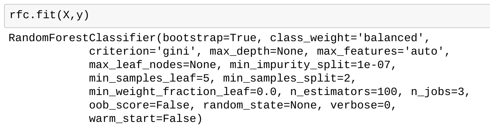
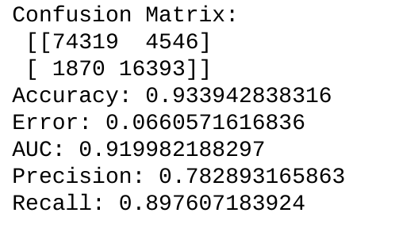

# Lending Club Default Predictor

This is an API that provides a probability of default when presented a loan from Lending Club. The API is written in Flask and it utilizes a scikit-learn machine learning model.

## Prerequisites

* Python 3
* Flask
* Flask-RESTful
* numpy
* scipy
* pandas
* scikit-learn (0.19.0) - pickled model may be version dependent

## Installation

Installation is completely up to you but it expects the typical Flask environment with the two pickled scikit-learn models in the same directory as the Flask app (this can be changed by modifying the joblib path within the app).

## Usage

The API expects a JSON file conforming to the current format from Lending Club. There is an example JSON file called `loanlist-example.json` showing the format the model expects.

There are three endpoints to the API:

* / (provides a readme/description)
* /version (provides a JSON output of the API version)
* /predict (this is the predictor)

To use the API, POST a JSON file matching the format of the example file provided. Be sure to set your Content-Type to `application\json` for the POST.

The API will then load the loans into a Pandas DataFrame, make some modifications, and then run them through the Random Forest Classifier model. It then will add another column to the DataFrame for the predicted probability of default/charge-off. Finally, the API will then return JSON output of the memberId and probability of default for each loan that was input.

## Machine Learning Model

The machine learning model is a Random Forest Classifier trained on all Lending Club loans from 2007 through the first half of 2017. It has the following parameters:

Below are the confusion matrix, accuracy, AUC, precision, and recall scores for the model:

For those who may not know, the confusion matrix shows the table of the following:

True positives | False negatives
----------------|----------------
False positives  | True negatives

You can read more about a confusion matrix on [Wikipedia](https://en.wikipedia.org/wiki/Confusion_matrix)

The two models used in the API are the following:

#### Label Encoder

Used for both the "term" and "grade" columns/features to encode them into labels. This, rather than one-hot encoding, was used due to the simplicity of the features and in an attempt to keep the feature size to a minimum (one of my goals was to enable this to run on a Raspberry Pi). It is important that this label encoder be loaded so that labels for new loans are consistent with those of the training set.

#### Random Forest Classifier

This model is a random forest classifier with 150 trees. It does the predicting and actually returns an array consisting of the probability the loan will not default and the probability it will. The API is only returning the probability of default, so the second field in the NumPy array.

### Performance

The classifier is pretty quick and should work just fine on even a Raspberry Pi.
